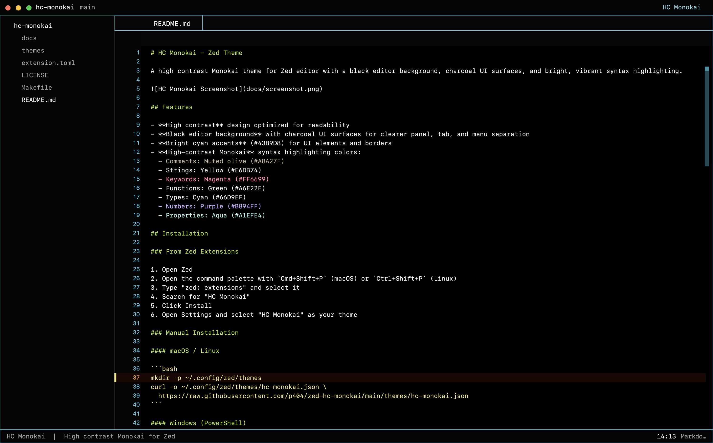

# HC Monokai P404 - Zed Theme

A high contrast Monokai theme for Zed editor with a dark charcoal background and bright, vibrant syntax highlighting.



## Features

- **High contrast** design optimized for readability
- **Dark charcoal** background that reduces eye strain
- **Bright cyan accents** (#43B9D8) for UI elements and borders
- **Classic Monokai** syntax highlighting colors:
  - Comments: Orange (#FD971F)
  - Strings: Yellow (#E6DB74)
  - Keywords: Magenta (#F92672)
  - Functions: Green (#A6E22E)
  - Types: Cyan (#66D9EF)
  - Numbers: Purple (#AE81FF)

## Installation

### From Zed Extensions

1. Open Zed
2. Open the command palette with `Cmd+Shift+P` (macOS) or `Ctrl+Shift+P` (Linux)
3. Type "zed: extensions" and select it
4. Search for "HC Monokai P404"
5. Click Install
6. Open Settings and select "HC Monokai P404" as your theme

### Manual Installation

#### macOS / Linux

```bash
mkdir -p ~/.config/zed/themes
curl -o ~/.config/zed/themes/hc-monokai-p404.json \
  https://raw.githubusercontent.com/p404/zed-hc-monokai/main/themes/hc-monokai-p404.json
```

#### Windows (PowerShell)

```powershell
New-Item -ItemType Directory -Force -Path "$env:USERPROFILE\AppData\Roaming\Zed\themes"
Invoke-WebRequest -Uri "https://raw.githubusercontent.com/p404/zed-hc-monokai/main/themes/hc-monokai-p404.json" `
  -OutFile "$env:USERPROFILE\AppData\Roaming\Zed\themes\hc-monokai-p404.json"
```

After installation, open Zed Settings and select "HC Monokai P404" as your theme.

## Color Palette

| Element | Color | Hex |
|---------|-------|-----|
| Background | Black | #000000 |
| Foreground | White | #FFFFFF |
| Accent/Border | Cyan | #43B9D8 |
| Comment | Orange | #FD971F |
| String | Yellow | #E6DB74 |
| Keyword | Magenta | #F92672 |
| Function | Green | #A6E22E |
| Type | Cyan | #66D9EF |
| Number | Purple | #AE81FF |

## Related

- [HC Monokai P404 for VS Code](https://github.com/p404/hc-monokai-p404) - The original VS Code theme

## License

MIT License - see [LICENSE](LICENSE)
